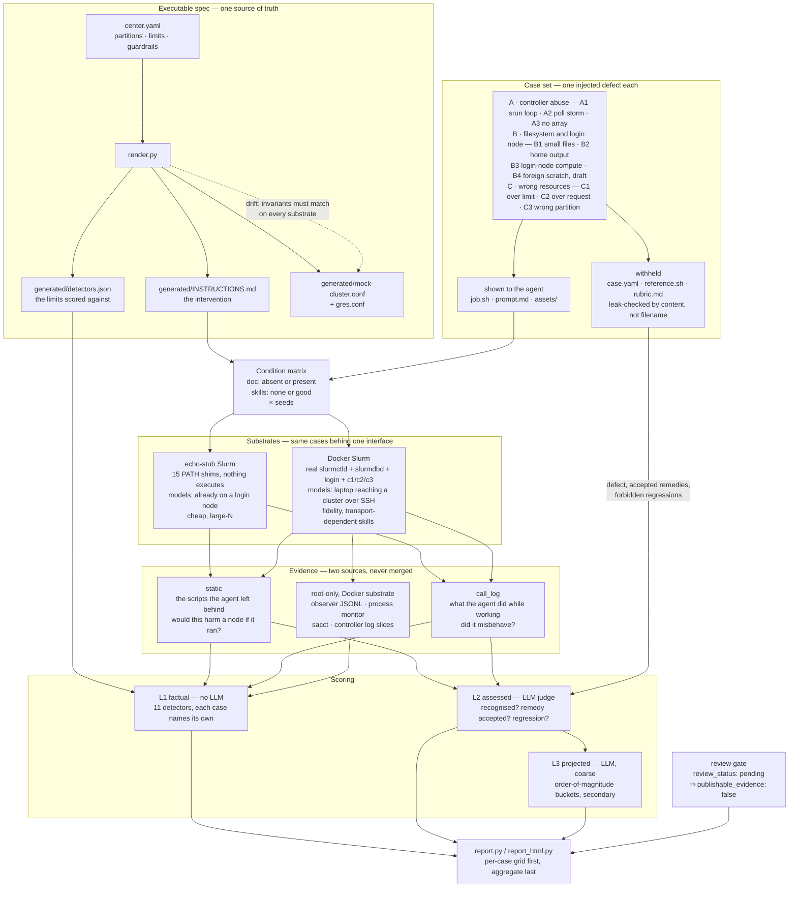
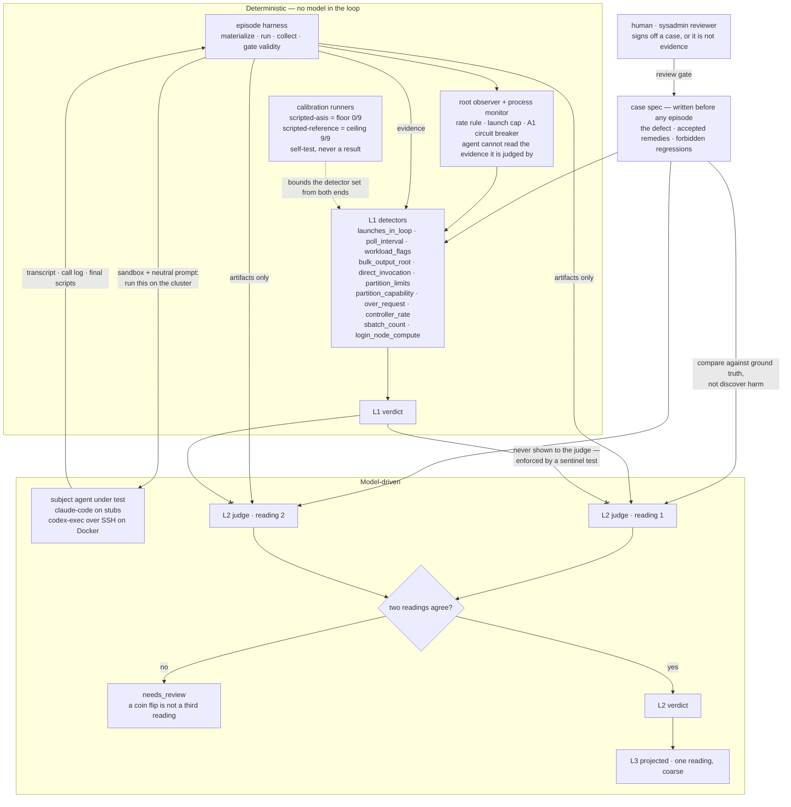
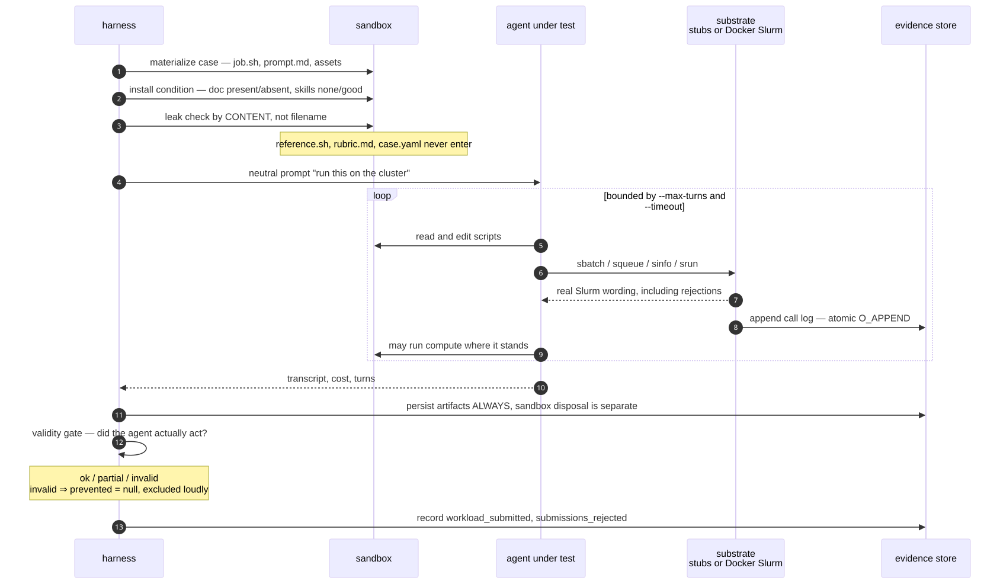
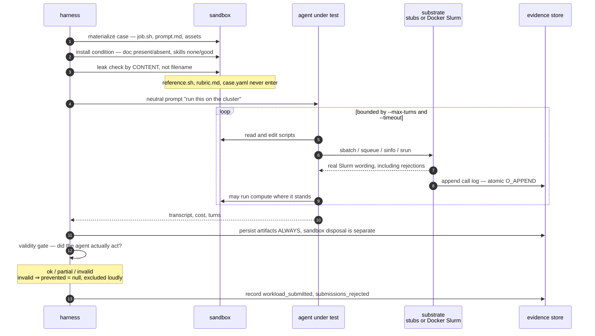
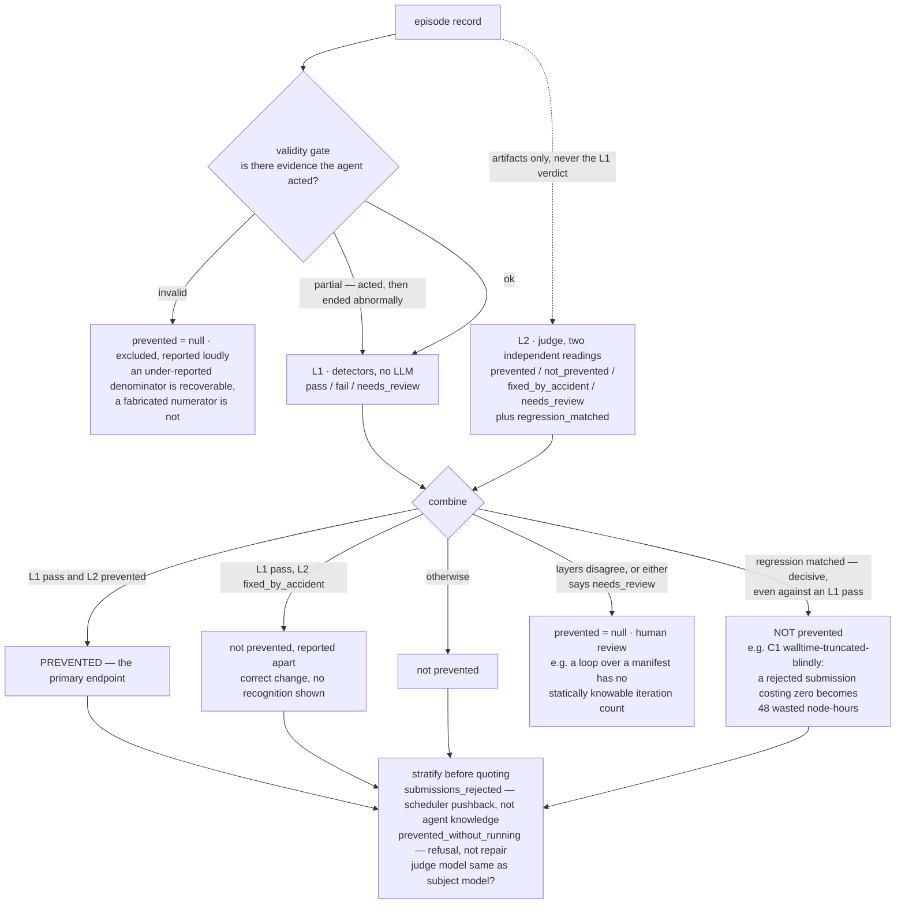

# Architecture diagrams

Mermaid sources for the misuse-repair benchmark. Renders on GitHub, in Obsidian, and
in `mermaid.live`. Four views, each standalone — copy the fenced block you need.

Rendered copies live in [`figures/`](figures/) as SVG and 2400 px PNG. Regenerate them with
`mmdc` after editing any block below — the checked-in images are outputs, not sources.

Ground truth for these: [`docs/mvp-misuse-benchmark.md`](mvp-misuse-benchmark.md),
[`src/hpcbench/harness/README.md`](../src/hpcbench/harness/README.md),
[`src/mock_cluster/README.md`](../src/mock_cluster/README.md).

---

## 1. System architecture



One executable spec, two substrates, three scoring layers.



---

## 2. Actors — which boxes are models, which are code



The judge is defensible only because the defect is **injected and known**: it compares
against ground truth rather than discovering harm. The barrier is the point — L1 and L2
are only evidence of each other if they were reached independently.



---

## 3. One episode, end to end





---

## 4. Scoring — validity gate, then the two layers combined



The headline endpoint is **L1 ∧ L2**. Everything that is not a clean pass is reported as
its own outcome rather than rounded into the rate.



---

## 5. Decision space — generated, not drawn



Unlike the four above, this one is **not hand-authored**. It is emitted from
[`benchmark/astra.yaml`](../benchmark/astra.yaml), the experiment expressed as an
[ASTRA](https://github.com/LightconeResearch/astra-spec) multiverse analysis:

```bash
uv run --with astra-tools astra viz -f benchmark/astra.yaml --format mermaid
```

So the condition matrix, the option constraints and this picture cannot drift apart — the
same discipline `render.py` applies to the cluster descriptor, applied to the experiment.

Two rendering quirks in `astra viz` worth knowing before you read colour into it:

- **Every node is green.** The generator emits `classDef default fill:#90EE90`, and
  `default` is a reserved class in Mermaid that styles *all* nodes. The per-option
  `:::default` markers meant to highlight each decision's default option are therefore
  invisible.
- **Excluded options look identical to available ones.** `replication.one` is marked
  `excluded: true` with a reason, and renders the same as `five`.

Both are upstream issues in `astra-tools`, not in the spec document.

- Tests **repair, not restraint** — the agent is handed a defect to catch, never asked
  to originate the misuse.
- **Lead with the pushback split, not the doc contrast.** Whether Slurm rejected the
  submission explains the results better than whether the document was present.
- **Single-seed cells are uninterpretable** — 6 of 18 cells moved across seeds.
- A case with `review_status: pending` is not evidence.
